# Práctica 7

### Daniel Marín López

1. Hacemos fork en el repositorio de nuestro compañero
2. Clonamos el repositorio
3. Creamos una rama y hacemos commit con nuestro trabajo
4. Subida al repositorio del compañero
5. Hacemos pull request
6. Hacemos un commit más al nuestro
7. Añadimos tag y clonamos en Linux

### 1. Hacemos fork en el repositorio de nuestro compañero

Vamos al repositorio del compañero le damos al botón *fork*.

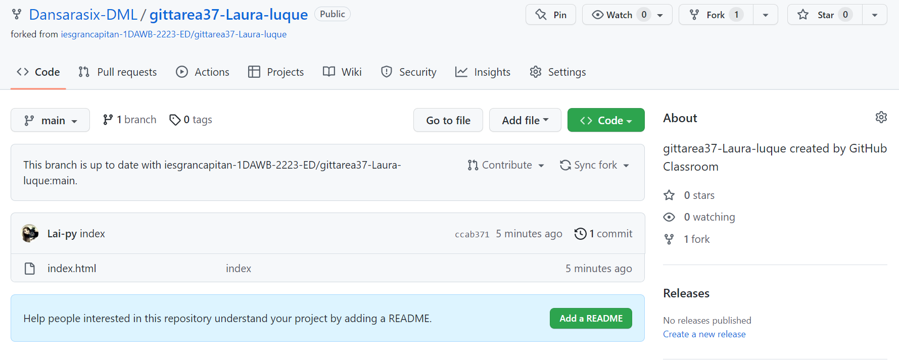

### 2. Clonamos el repositorio

Hecho el fork, clonamos el repositorio en nuestra máquina física.

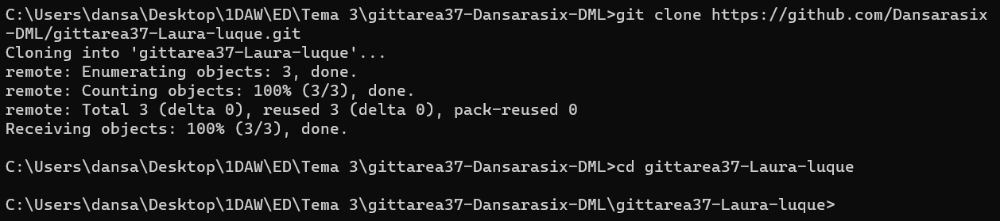

### 3. Creamos una rama y hacemos commit con nuestro trabajo

Tras esto creamos una rama donde haremos nuestros cambios.

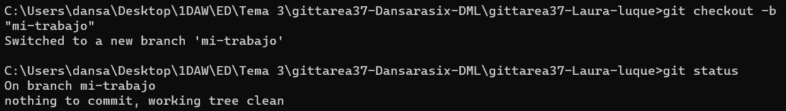

Y luego lo guardamos en commit.

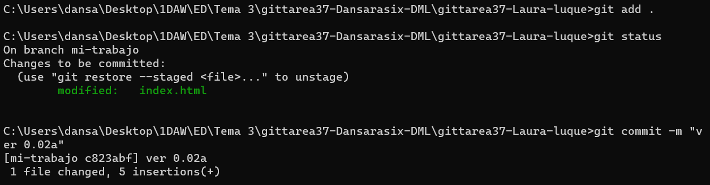

### 4. Subida al repositorio del compañero

Hacemos una subida con el siguiente comando:

~~~
git remote url
~~~

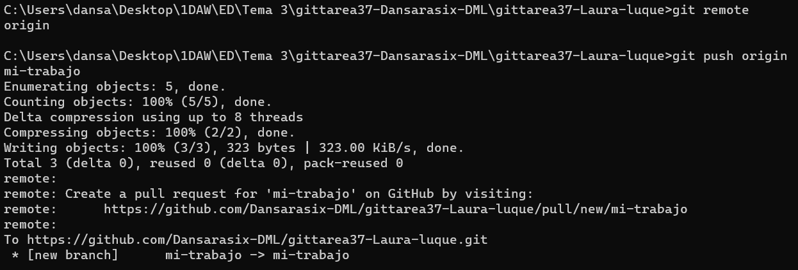

### 5. Hacemos pull request

Una vez subido el cambio, se nos dará la oportunidad de hacer un pull request.

Para ello nos vamos a la pestaña pull rquest del repositorio de nuestro compañero y aceptamos que se haga.

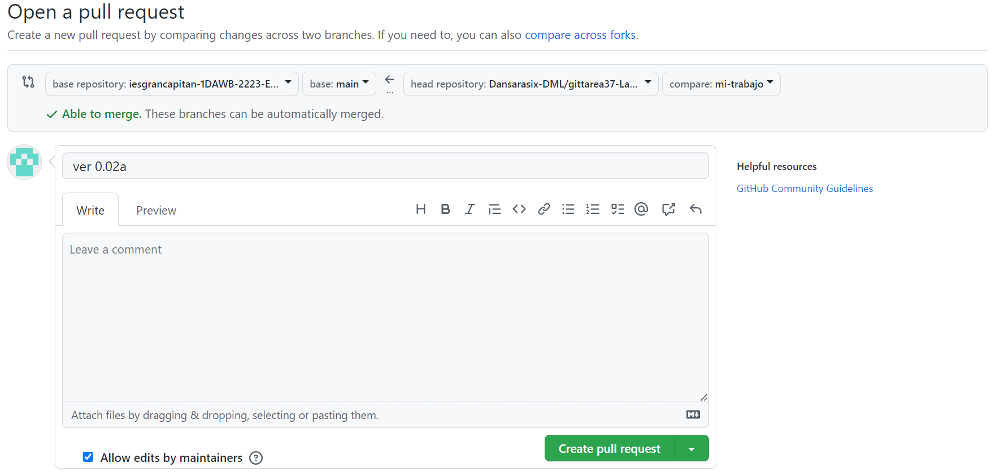

Luego nos vamos a nuestro repositorio y aceptamos los cambios enviados por nuestro compañero.

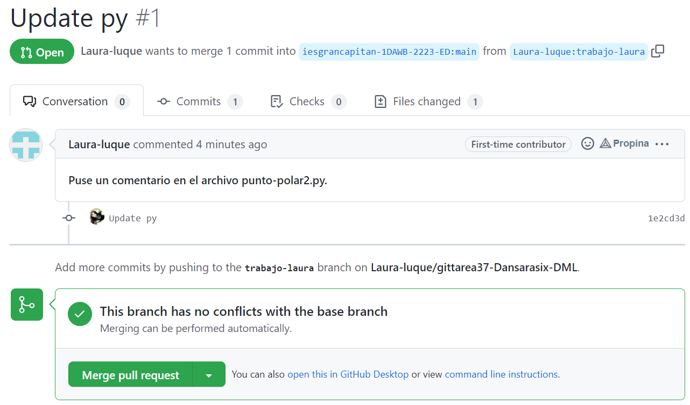

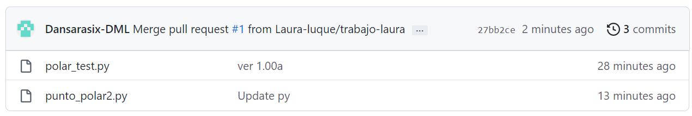

### 6. Hacemos un commit más al nuestro

Por último añadimos un commit más a nuestro repositorio con unos pocos cambios más.

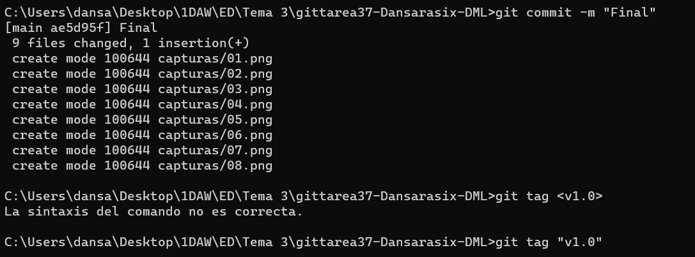

### 7. Añadimos tag y clonamos en Linux

Para añadir un tag hacemos el siguiente comando:

~~~
git tag <tag>
~~~

Y luego lo subimos con:

~~~
git push --tags
~~~

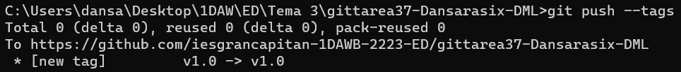

Finalizamos clonando el repositorio en Linux a traves del tag previamente creado con:

~~~
git clone -b <tag> <url>
~~~

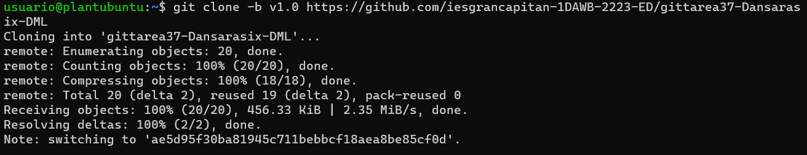

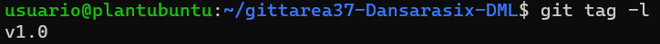

